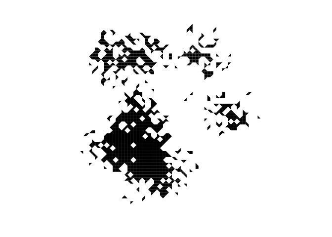
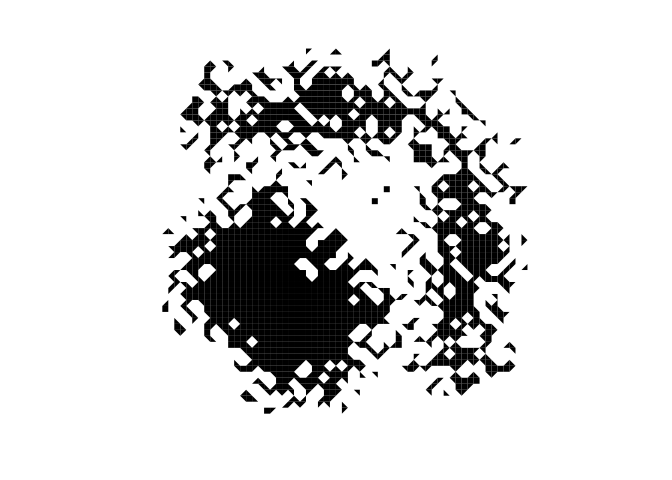

<!-- README.md is generated from README.Rmd. Please edit that file -->
blotr: Blotting matrices since 2016
===================================

This package does one thing: create symmetric matrices from asymmetric matrices. It is inspired by [This tweet](https://twitter.com/algaebarnacle/status/713103252582064128).

The basic idea is that you fold your matrix across the diagonal to create a symmetric matrix like an inkblot for a [Rorschach test](https://en.wikipedia.org/wiki/Rorschach_test).

How do I use it?
----------------

There is only one function called `blot()`.

### Simple example

``` r
library("blotr")
set.seed(20160325)
mat <- matrix(sample(c(NA, 1), 100, replace = TRUE), 10, 10)
diag(mat) <- 0
mat
#>       [,1] [,2] [,3] [,4] [,5] [,6] [,7] [,8] [,9] [,10]
#>  [1,]    0    1   NA    1   NA    1   NA   NA   NA     1
#>  [2,]    1    0    1    1    1   NA    1    1   NA    NA
#>  [3,]   NA   NA    0    1    1    1   NA   NA   NA    NA
#>  [4,]   NA    1    1    0   NA    1   NA    1    1     1
#>  [5,]   NA    1   NA   NA    0   NA    1   NA   NA    NA
#>  [6,]    1   NA    1   NA    1    0    1    1   NA     1
#>  [7,]    1    1   NA   NA    1    1    0    1    1     1
#>  [8,]   NA   NA    1    1   NA    1   NA    0    1    NA
#>  [9,]    1    1    1   NA   NA    1   NA   NA    0    NA
#> [10,]    1    1   NA    1   NA   NA    1   NA    1     0
isSymmetric(mat)
#> [1] FALSE
```

The matrix is non-symmetrical! We'll make it symmetrical with `blot()`!

``` r
blot(mat)
#>       [,1] [,2] [,3] [,4] [,5] [,6] [,7] [,8] [,9] [,10]
#>  [1,]    0    1   NA    1   NA    1    1   NA    1     1
#>  [2,]    1    0    1    1    1   NA    1    1    1     1
#>  [3,]   NA    1    0    1    1    1   NA    1    1    NA
#>  [4,]    1    1    1    0   NA    1   NA    1    1     1
#>  [5,]   NA    1    1   NA    0    1    1   NA   NA    NA
#>  [6,]    1   NA    1    1    1    0    1    1    1     1
#>  [7,]    1    1   NA   NA    1    1    0    1    1     1
#>  [8,]   NA    1    1    1   NA    1    1    0    1    NA
#>  [9,]    1    1    1    1   NA    1    1    1    0     1
#> [10,]    1    1   NA    1   NA    1    1   NA    1     0
isSymmetric(blot(mat))
#> [1] TRUE
```

We can also choose to keep only the upper triangle if we wish:

``` r
blot(mat, ut = TRUE)
#>       [,1] [,2] [,3] [,4] [,5] [,6] [,7] [,8] [,9] [,10]
#>  [1,]    0    1   NA    1   NA    1    1   NA    1     1
#>  [2,]   NA    0    1    1    1   NA    1    1    1     1
#>  [3,]   NA   NA    0    1    1    1   NA    1    1    NA
#>  [4,]   NA   NA   NA    0   NA    1   NA    1    1     1
#>  [5,]   NA   NA   NA   NA    0    1    1   NA   NA    NA
#>  [6,]   NA   NA   NA   NA   NA    0    1    1    1     1
#>  [7,]   NA   NA   NA   NA   NA   NA    0    1    1     1
#>  [8,]   NA   NA   NA   NA   NA   NA   NA    0    1    NA
#>  [9,]   NA   NA   NA   NA   NA   NA   NA   NA    0     1
#> [10,]   NA   NA   NA   NA   NA   NA   NA   NA   NA     0
```

### Now let's have some fun

Let's generate some inkblots and visualize them:

``` r
set.seed(20160326)
mat <- matrix(NA_integer_, 100, 100)
x   <- replicate(20, rnorm(250, mean = sample((3:7)*10, 1), 5))
y   <- replicate(20, rnorm(250, mean = sample((3:7)*10, 1), 5))
obs <- matrix(round(c(x, y)), ncol = 2)
mat[obs]  <- 1L
diag(mat) <- 0L
isSymmetric(mat)
#> [1] FALSE
```

Now for the plotting. First, the without blotting:

``` r
robs  <- range(obs)/100
fx    <- seq(0, 1, length.out = 100)
omar  <- par("mar")
par(mar = c(0, 0, 0, 0))
plot(NA, xlim = robs, ylim = robs, type = "n", asp = 1, ann = FALSE, axes = FALSE)
.filled.contour(fx, fx, mat, c(0, 1), col = "black")
```

<!-- -->

``` r
par(mar = omar)
```

Now, with blotting:

``` r
par(mar = c(0, 0, 0, 0))
plot(NA, xlim = robs, ylim = robs, type = "n", asp = 1, ann = FALSE, axes = FALSE)
.filled.contour(fx, fx, blot(mat), c(0, 1), col = "black")
```

<!-- -->

``` r
par(mar = omar)
```

Installation
------------

You can install blotr via devtools::

``` r
devtools::install_github("zkamvar/blotr")
```
